# Last Hunt

> DirectX 11 3D 게임 엔진 · 전용 에디터 · C++ IOCP 서버로 제작한 멀티플레이 액션 RPG

[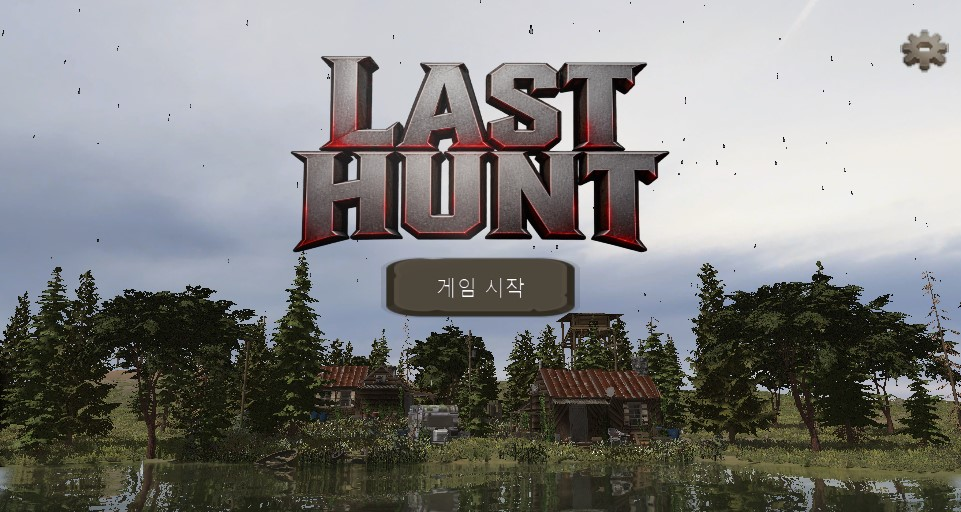](https://youtu.be/3Qh1aHhzQOg)

[시연 영상](https://youtu.be/3Qh1aHhzQOg) · [클라이언트 저장소](https://github.com/Macho99/DirectX3D) · [서버 저장소](https://github.com/Macho99/CppServer)

## 프로젝트 소개

DirectX 11 기반의 **3D 게임 엔진과 전용 에디터를 직접 구현**하고, 별도의 **IOCP 비동기 서버**와 연결해 실제 멀티플레이 콘텐츠까지 완성한 1인 프로젝트입니다.

렌더링 기능을 단일 데모로 끝내지 않고 `Scene → GameObject → Component` 구조, 애셋 임포트, 제작 도구, 애니메이션, NavMesh, UI, 네트워크 게임플레이가 하나의 제작 파이프라인으로 이어지도록 구성했습니다.

| 구분 | 내용 |
| --- | --- |
| 개발 형태 | 개인 프로젝트 · 기여도 100% |
| 개발 기간 | 엔진 개발 6개월 · 콘텐츠 개발 2주 · 2026.08 |
| 플랫폼 | Windows |
| 클라이언트 | C++ · DirectX 11 · HLSL · Win32 API |
| 서버 | C++ · IOCP · Protocol Buffers |
| 도구 | ImGui · ImGuizmo · Assimp · Cereal · Python/Jinja2 |

## 핵심 성과

| 영역 | 구현 결과 |
| --- | --- |
| 모델 배칭 | 모듈형 건물 기준 약 **130 Draw Call → 2 Draw Call** |
| 자연환경 | 약 **200만 개 후보 위치**를 Compute Shader로 컬링한 뒤 Indirect Draw |
| 파티클 | Geometry Shader + Stream Output 기반으로 최대 **10,000개**를 GPU에서 갱신 |
| 그림자 | 시야 깊이에 따라 선택하는 **2-Cascade CSM** |
| NavMesh | 입력 Mesh부터 Detail Mesh, A*, Funnel까지 전체 빌드·탐색 파이프라인 구현 |
| 멀티플레이 | 서버 권한형 월드 시뮬레이션과 Dirty 상태 기반 약 **20Hz** 동기화 |

## 전체 구조

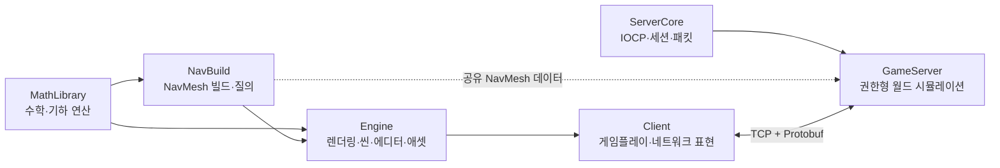

| 모듈 | 역할 | 위치 |
| --- | --- | --- |
| `Engine` | 렌더링, 씬, 컴포넌트, 에디터, 애셋, 애니메이션, UI, 오디오 | 현재 저장소 |
| `Client` | 플레이어·몬스터 표현, 전투, 상점, HUD, 서버 동기화 | 현재 저장소 |
| `NavBuild` | NavMesh 빌드, 경로 탐색, 위치 검증 | 현재 저장소 |
| `MathLibrary` | 벡터·행렬, 2D/3D 기하, 공용 수학 기능 | 현재 저장소 |
| `ServerCore` | IOCP, Session, Send/Recv Buffer, JobQueue | 별도 서버 저장소 |
| `GameServer` | 월드, 플레이어·몬스터 상태, 전투 판정, 브로드캐스트 | 별도 서버 저장소 |

## 핵심 기능

### 1. 컴포넌트 기반 씬과 Unity 스타일 API

- `Scene → GameObject → Component` 계층으로 객체를 조합
- `Awake → Start → Update → LateUpdate` 생명주기 제공
- 부모·자식 Transform 계층과 활성 상태 전파
- 고정 컴포넌트와 `MonoBehaviour` 스크립트를 같은 방식으로 관리
- GUID, SlotManager, Ref 타입을 이용한 객체 참조와 수명 관리
- Cereal 기반 Scene·GameObject·Component 직렬화 및 복제
- 씬이 렌더러를 수집·분류하고 Material/Mesh 기준 Instancing Batch 생성

### 2. ImGui 기반 통합 에디터

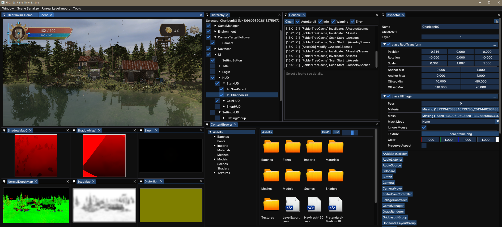

- Docking 기반 Scene View, Hierarchy, Inspector, Content Browser, Console, Debug Texture
- 오브젝트 선택·포커스·이름 변경·활성화와 부모/자식 Drag & Drop
- ImGuizmo 기반 Transform 및 RectTransform 편집
- 애셋과 SubAsset Drag & Drop, 컴포넌트 추가, 프로퍼티 실시간 수정
- 렌더 타깃, 애니메이션 Bone, NavMesh 빌드 단계 디버그 시각화
- 모델 배칭, Cubemap 생성, Terrain 배치 등 콘텐츠 제작 도구

### 3. GUID 기반 애셋 파이프라인

```text
Source Asset
    ↓ 변경 감지
Meta File → Import Setting / Asset ID
    ↓ Import
Artifact → Runtime Resource
```

- 파일 변경 자동 감지와 선택적 재임포트
- Meta Version, Import Version, Manifest로 임포트 상태 관리
- 파일 이동·이름 변경 이후에도 Asset ID로 씬 참조 유지
- Assimp로 FBX의 Texture, Material, Mesh, Animation 자동 추출
- Texture Block Compression과 모델 내부 SubAsset 관리
- `ResourceRef`, `AssetRef`를 통한 타입 안전 리소스 참조

### 4. 캐릭터 애니메이션

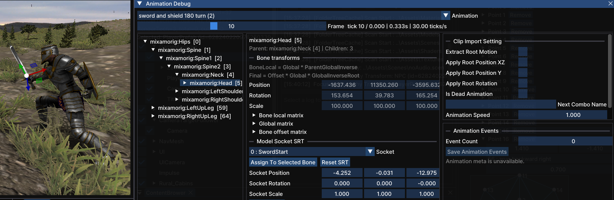

- Skeletal Animation과 GPU Skinning용 Animation Texture 생성
- Delaunay 2D Blend Space에서 최대 3개 애니메이션 가중치 보간
- 하체 이동과 상체 총기 동작을 조합하는 Animation Override
- 프레임별 Root Motion, 이동 속도, Animation Event 추출
- 서버 이동 동기화에 Root Motion 데이터를 사용
- Bone Socket과 Socket Follower로 무기·Trail·Effect 추적

### 5. DirectX 11 렌더링

<table>
  <tr>
    <td>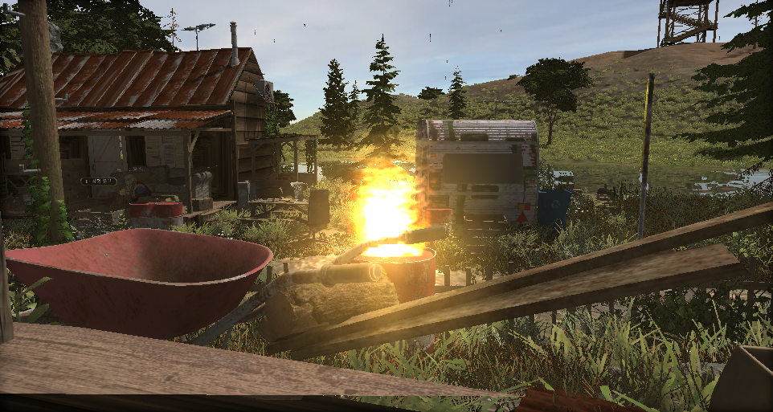</td>
    <td>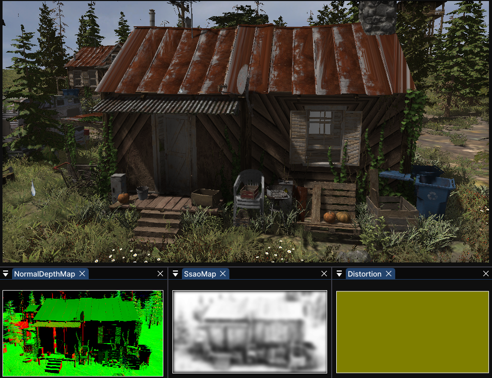</td>
    <td>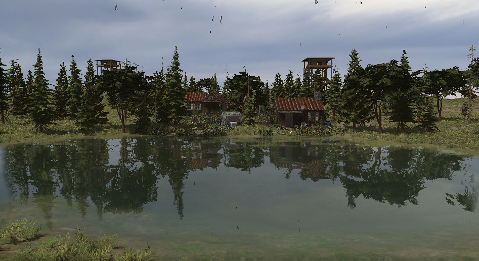</td>
  </tr>
  <tr>
    <td align="center">HDR Bloom</td>
    <td align="center">Half-resolution SSAO</td>
    <td align="center">View-space SSR</td>
  </tr>
</table>

- `R16G16B16A16_FLOAT` HDR 타깃, 밝기 추출, 다단 Downsample/Blur/Upsample, Tone Mapping
- 2-Cascade Shadow Map과 시야 깊이 기반 Cascade 선택
- Normal/Depth 기반 Half-resolution SSAO와 4회 Blur
- View Space Ray Marching, Binary Search 보정, Sky Cubemap fallback을 포함한 SSR
- Normal Mapping, Sky, Billboard, Trail, Shockwave, GPU Particle System
- Perspective 월드 카메라와 Orthographic UI 카메라 분리

#### Distortion 공용 후처리

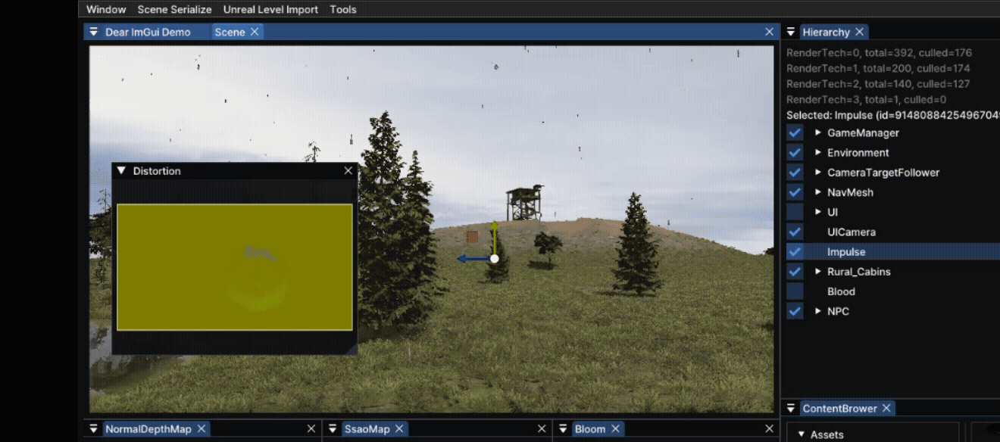

왜곡 오브젝트가 RG 채널에 화면 오프셋을 기록하고, 후처리 단계에서 HDR Scene UV를 이동시킵니다. Trail과 Shockwave가 같은 파이프라인을 공유합니다.

### 6. GPU 중심 최적화

- Material/Mesh Asset ID 기반 GPU Instancing
- 월드 Bounding Box와 카메라 평면을 이용한 Frustum Culling
- Animation Texture를 Vertex Shader에서 샘플링하는 Skinned Mesh Instancing
- 모듈형 건물을 하나의 Mesh와 Texture Atlas로 결합해 약 130 Draw Call을 2회로 축소
- Particle을 Stream Output Ping-Pong Buffer에서 갱신하고 `DrawAuto`로 CPU Readback 제거
- Geometry Shader에서 Point를 Camera-facing Billboard Quad로 확장

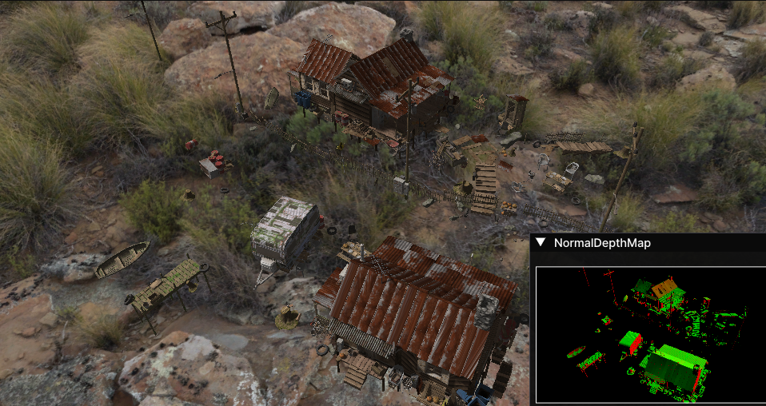

### 7. Terrain과 대규모 자연환경

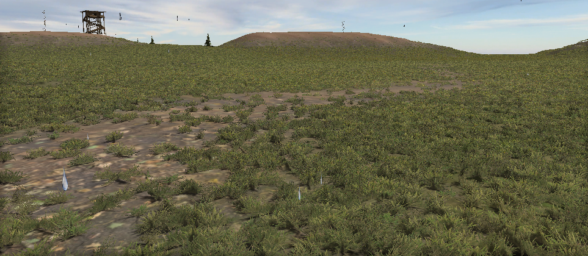

- Height Map을 64×64 Cell의 Quad Patch로 구성하고 거리 기반 Tessellation 적용
- Hull Shader 단계의 Frustum Culling과 Domain Shader 높이 샘플링
- Texture Array + Blend Map으로 최대 5개 Terrain Layer 표현
- Raise/Lower, Smooth, Texture Paint, 모델 배치 에디터 도구
- 약 200만 개 Grass 후보를 거리·Frustum·Blend Layer 조건으로 Compute Culling
- Near/Far Append Buffer와 `CopyStructureCount`를 이용한 `DrawInstancedIndirect`
- CPU Readback 없이 LOD별 Grass를 렌더링하고 바람 애니메이션 적용

### 8. 자체 NavMesh 빌드와 길찾기

<table>
  <tr>
    <td>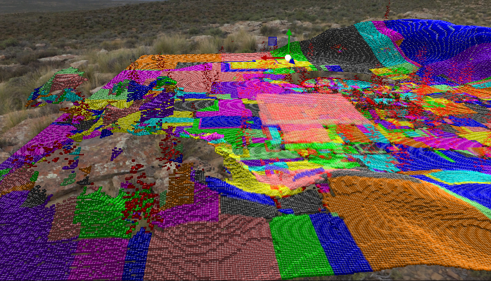</td>
    <td>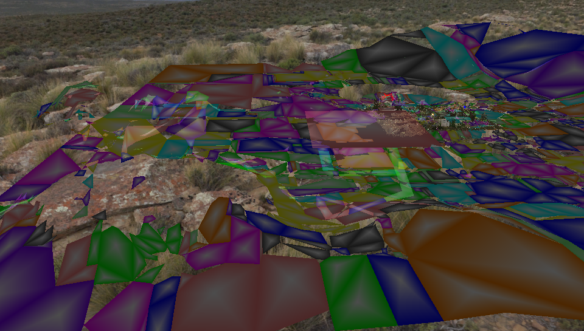</td>
    <td>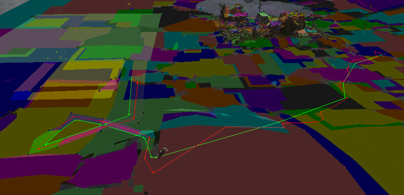</td>
  </tr>
  <tr>
    <td align="center">Compact Height Field</td>
    <td align="center">Polygon / Detail Mesh</td>
    <td align="center">A* + Funnel</td>
  </tr>
</table>

1. 입력 Mesh에서 Material 제외 조건과 경사도로 이동 가능 삼각형 판별
2. Voxel Height Field 생성 후 Agent Height/Climb 조건으로 필터링
3. 이동 가능한 Span을 Compact Height Field로 압축하고 이웃 연결 정보 생성
4. Watershed 방식으로 Region을 분리하고 작은 영역과 구멍 제거
5. Region 외곽선을 추적하고 RDP 알고리즘으로 Contour 단순화
6. Ear Clipping 삼각분할 후 삼각형을 Convex Polygon으로 병합
7. 지형 높이를 재샘플링하고 Delaunay 삼각분할로 Detail Mesh 생성
8. Polygon 인접 정보를 이용한 A*와 Simple Stupid Funnel 경로 최적화
9. Root Motion 이동 중 Agent를 NavMesh 내부로 보정하고 Detail Mesh에서 높이 추출

### 9. 해상도 대응 UI와 게임플레이

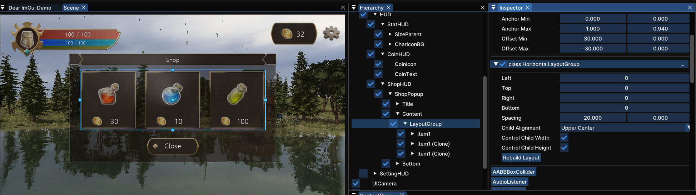

- Anchor 기반 RectTransform과 해상도 변경 대응
- Image, Text, Button, InputText, ScrollView, UI Mask
- Horizontal, Vertical, Grid Layout Group
- 한글 입력, 삭제, 입력 커서와 이미지 비율 유지
- 3인칭 이동·공격·피격·사망과 Target Follower 카메라
- 몬스터 탐색·추격·공격·사망, NPC 상호작용과 상점
- Animation Event로 공격 판정, Trail, Particle, 3D Sound 실행
- HP·MP·SP·Coin HUD와 서버 Stat 기반 실시간 갱신

### 10. IOCP 비동기 서버

서버 코드는 [별도 저장소](https://github.com/Macho99/CppServer)에서 관리합니다.

#### 완료 통지 기반 네트워크 I/O

- `AcceptEx → WSARecv → IOCP → WSASend` 흐름으로 완료된 작업만 Worker가 처리
- Connect, Recv, Send, Disconnect 이벤트를 Session이 타입별로 디스패치
- Session별 Send Queue와 Atomic Flag로 중복 Send 등록 방지
- 수신 처리 직후 다음 `WSARecv`를 등록하고 비동기 이벤트 수명을 관리

#### TCP 패킷과 코드 생성

```text
SIZE (2B) | PACKET ID (2B) | PROTOBUF PAYLOAD
```

- RecvBuffer가 TCP 분할·합쳐짐을 처리하고 완전한 패킷만 Handler에 전달
- Header의 전체 크기와 Packet ID를 검사하며 불완전 데이터는 다음 수신까지 보존
- `.proto → Python + Jinja2 → PacketHandler.h` 코드 생성
- Packet ID 등록, `ParseFromArray`, SendBuffer 생성 코드를 자동화

#### 월드 동시성과 서버 권한 모델

- `Network Thread → DoAsync → World JobQueue → World Simulation` 순서로 처리
- 같은 월드의 작업을 순차 실행해 공유 상태의 동시 수정 방지
- JobTimer 우선순위 큐로 예약 작업을 분배하고, 실행 시간을 넘기면 Global Queue에 양보
- 클라이언트는 Key Down/Up, Camera Yaw, 상점 요청 등 입력만 전송
- 서버가 이동 속도·스태미나·공격 거리/시야각·스탯·몬스터 AI와 사망을 판정
- Transform, Animation, HP/Stat, Spawn/Despawn 중 Dirty 상태만 약 20Hz로 브로드캐스트

### 11. 오디오

- `AudioSource`와 `AudioListener` 컴포넌트
- 2D/3D Sound, 거리 감쇠, SFX/BGM/UI/Voice 그룹
- Master 및 그룹별 Volume 제어
- Animation Event와 피격 이벤트에 Sound 연결

## 기술적 특징

- **제작 파이프라인 연결:** 에디터에서 설정한 렌더링·애니메이션·NavMesh 데이터를 직렬화해 실제 게임에서 사용
- **데이터 중심 설계:** Meta와 Import Setting으로 코드 수정 없이 콘텐츠 설정
- **참조 안정성:** GUID와 Ref 타입으로 애셋 및 씬 객체의 생명주기를 관리
- **GPU 중심 처리:** Instancing, Animation Texture, Stream Output, Compute Grass로 반복 작업을 GPU에 배치
- **서버 권한형 구조:** 클라이언트 입력과 서버 결과를 분리해 이동·전투·상태 판정의 일관성 유지
- **디버깅 가능성:** 렌더 패스, Bone, Terrain, NavMesh 중간 결과를 에디터에서 단계별 확인

## 주요 디렉터리

```text
GameCoding/
├─ Engine/          # 엔진 런타임과 에디터
├─ Client/          # 게임 클라이언트와 네트워크 표현
├─ NavBuild/        # NavMesh 생성과 경로 질의
├─ MathLibrary/     # 공용 수학 라이브러리
├─ Assets/          # Scene, Shader, Material, Meta 데이터
├─ Resources/       # Model과 Texture 원본 리소스
├─ EditorResource/  # 에디터 UI 리소스
├─ DebugTextures/   # 렌더링 단계별 디버그 출력
└─ Docs/Images/     # README 이미지와 GIF
```

## 솔루션

Visual Studio 솔루션은 `DX11_3D.sln`입니다.
